# CozyControl

CozyControl is a sample UI android application created using Flutter and Dart. It allows users to remotely control their home appliances. This project serves as the final project for Application Development. This proposal is aligned with SDG 7 "Affordable and Clean Energy" in terms of being able to ensure proper energy consumption and management of electrical devices/application.

Created by Bien Joshua Macuha, Ervin Rey Capuno, Karl Phillip Caringal, Nico Angelo Burog 

## Features
- By long-pressing a room, the user can view the lux and temperature levels of that room and set the control mode to either automatic or manual.
- By tapping a room once, the user can see the different devices installed in that room.
- The user can view the kWh usage and the current state (on or off) of each device by tapping on it, which will bring up a bottom sheet allowing them to turn the device on or off.
- There is a settings option to connect to the microcontroller via Bluetooth Low Energy (BLE) or WiFi.
- The user can add a new room or add a device to a specific room but it will not totally display the added rooms/device but it will have a snackbar saying that it was added.
- We did not implement the login, register, and logout function.

## Navigation
- Note: Long pressing the rooms will show the room informmation and options, one tap on the room card will show the devices in the room.


## YouTube Link: 
- Figma UI demo: https://youtu.be/iyiVLka8Ti8
- Android UI demo: https://youtu.be/CvERUp0tJNI

## Prerequisites
1. Flutter SDK: Make sure you have the Flutter SDK installed. If not, you can download it from [flutter.dev](https://docs.flutter.dev/get-started/install).
2. Android Studio: Install Android Studio, which includes the Android Emulator.
3. Android SDK: Ensure that the Android SDK is installed and properly configured in Android Studio.
4. AVD (Android Virtual Device): Set up an Android Virtual Device (AVD) in Android Studio.
Running Flutter Doctor
Before proceeding, run the following command to check for any missing dependencies or issues:
```bash
flutter doctor
```
This command will check your environment and display a report of the status of your Flutter installation. It will also provide information on any additional steps required to set up your development environment.

## Setting Up the Android Emulator
1. Open Android Studio.
2. Navigate to the Homepage and find the SDK Manager.

3. Click the SDK tools and check the Android SDK Command line.

4. Navigate to the homepage and click the Virtual Device Manager.

5. Click on Create Virtual Device and follow the prompts to set up your virtual device.
6. Once the virtual device is set up, click on the Play button to start the emulator.

- Note if there is no virtual device click the + icon and then download the virtual device and also you must navigate to the Windows Features and then check the Hyper V platform and then restart the computer


## Third-Party Packages Used/Dependencies
##### [To search the packages that used in this project](https://pub.dev/)
- flutter_arc_speed_dial: (version 2.0.1) used to create the arc speed dial. 

link: https://pub.dev/packages/flutter_arc_speed_dial

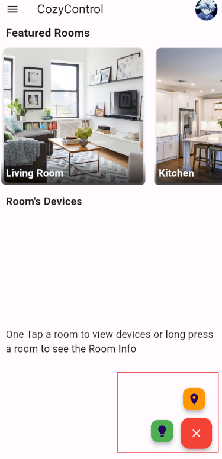

- flutter_launcher_icons (version 0.13.1): Used to change the app icon.

link: https://pub.dev/packages/flutter_launcher_icons

- rename_app (version 1.6.1): Used to change the app's name.

link: https://pub.dev/packages/rename_app

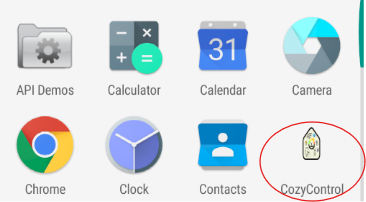


- skeleton_text (version 3.0.1): to create a skeleton loading page.

link: https://pub.dev/packages/skeleton_text

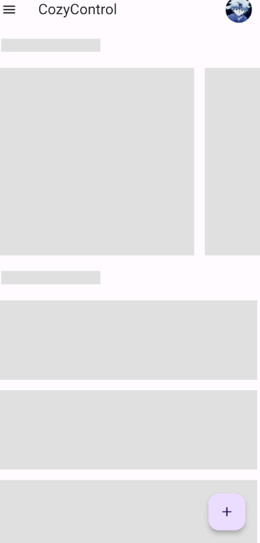

- image_picker: (version 0.8.5+3): Used to pick image from the local device.

link: https://pub.dev/packages/image_picker

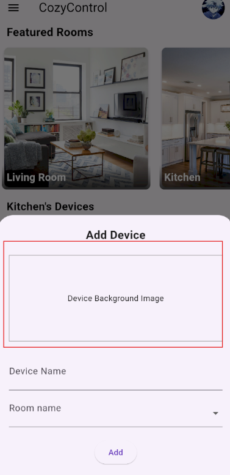

## Getting Started with the Flutter Project
This guide walks you through setting up and runnin this downloaded Flutter project.
- Note: Ensure you must have a git bash installed in your computer.

1. Download the Project
Open your terminal and navigate to the desired directory where you want to clone the project. Then, use the following command to clone the project from GitHub:

```bash
git clone git@github.com:Ervin-Capuno/flutter_ui_final_project.git
```
or using HTTPS
```Bash
git clone https://github.com/Ervin-Capuno/flutter_ui_final_project.git
```

2. Install Dependencies

Navigate to the project directory after cloning it. In your terminal, run the following command to fetch and install all the required packages:

```Bash
flutter pub get
```

This command ensures that all necessary packages listed in the project's pubspec.yaml file are downloaded and ready to use.

3. Check for Running Android Emulator

Before running the Flutter application, make sure you have an Android emulator set up and running. You can use Android Studio's built-in emulator or a third-party emulator like Genymotion. Refer to the official Android developer documentation for detailed instructions on setting up an emulator: https://developer.android.com/about/versions/14/setup-sdk

4. List Available Devices

Use the following command in your terminal to see a list of connected devices and emulators, including their unique device IDs:

```Bash
flutter devices
```

This will display a list of available devices, allowing you to identify the correct target for running your Flutter app.
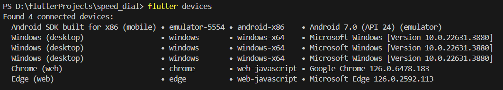
5. Run the Flutter Application

From the list of devices displayed in step 4, note down the ID of the Android emulator you want to use (e.g., emulator-5554). Then, run the following command in your terminal to start the Flutter application on that specific emulator:
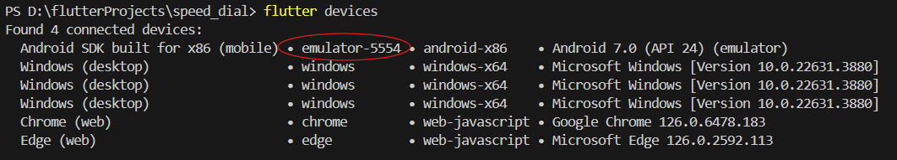
```Bash
flutter run -d emulator-5554
```

Be sure to replace emulator-5554 with the actual ID of your chosen emulator. This command tells Flutter to run your app on the specified device using hot reload functionality. Any code changes you make will be automatically reflected in the running app, streamlining the development process.

Additional Tips:

If you encounter issues with the emulator setup, double-check your Android Studio (or emulator) configuration and ensure the emulator is properly linked and running.
For more advanced usage, refer to the official Flutter documentation for in-depth instructions on various development aspects: https://docs.flutter.dev/

## Sample UI
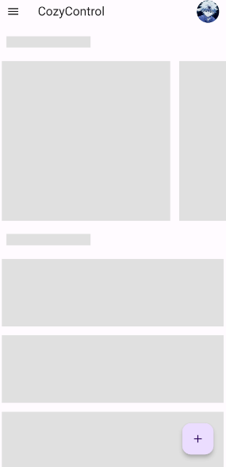
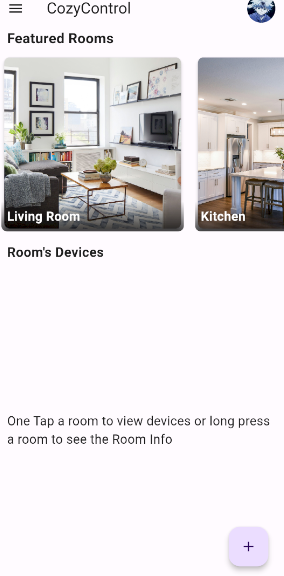
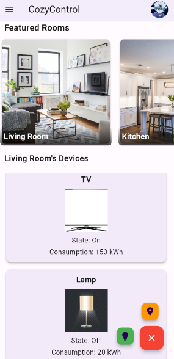
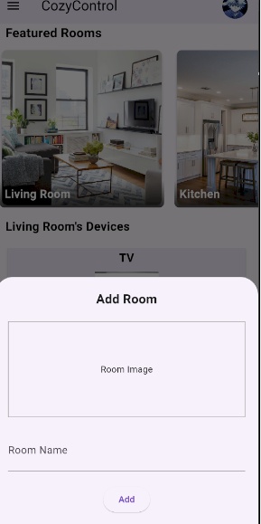
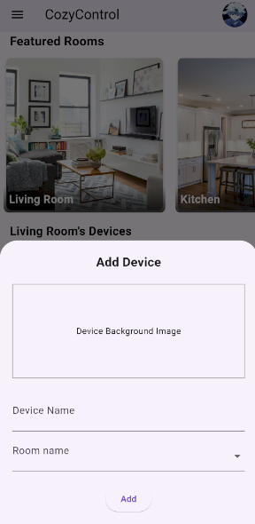
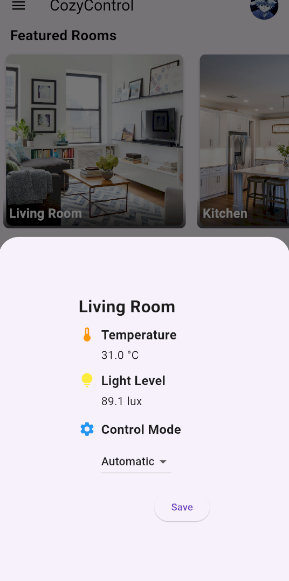
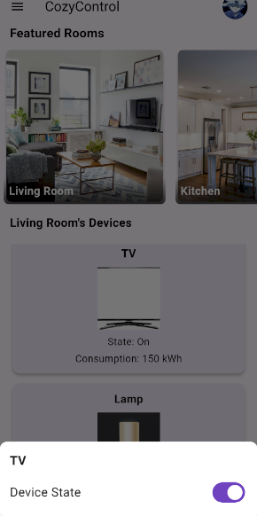
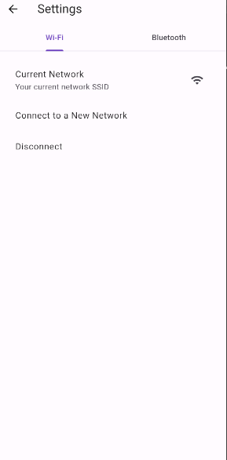
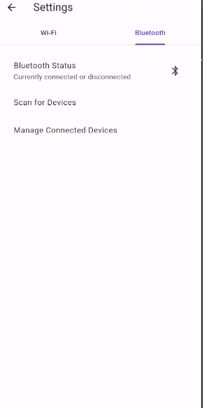
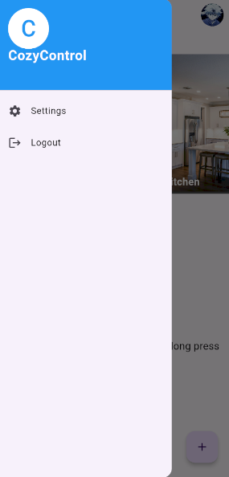


## Members
- [Bien Joshua Macuha](https://github.com/bienjoshuaa)
- [Ervin Rey Capuno](https://github.com/Ervin-Capuno)
- [Karl Phillip Caringal](https://github.com/caringalkarl)
- [Nico Angelo Burog](https://github.com/NicoAngeloBurog)